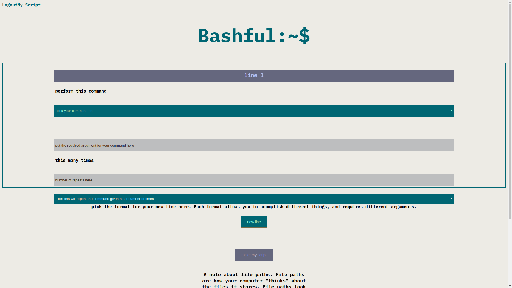

<h1>Bashful</h1>

<a href="https://bashful.now.sh/" target= "_blank">Live link</a>

This is bashful a simple bash script generator meant for novices just getting started with bash.

<h2>Summary</h2>
 
<image src="./public/bashful_screenshots/bashful_main_page.png" alt = "an image of the main page of bashful">
User has acess to basic explanation of bash and scripts on the main page. Title page will be converted to snake case to use as a file name if they desire.
 

User has acess to a selection of bash functionality to introiduce them to concepts and allow for low level automation. all data entered or selected by the user is concatenated into a string with the proper syntax.
 
<image src="./public/bashful_screenshots/bashful_output_page.png"> Concatenated Script will be output here. instructions for how to save and enable scripts for mac and Linux are below. Windows instructions not currently implemented due to lack of native bash.
 

 

<h3>demo credentials</h3>
username: TEST password: Password1234!
<h3>Technology</h3>
Made with React, express, Postgresql,javascript, Node, Sass, Jquery, bcryptjs, date-fns and Jsonwebtoken.
